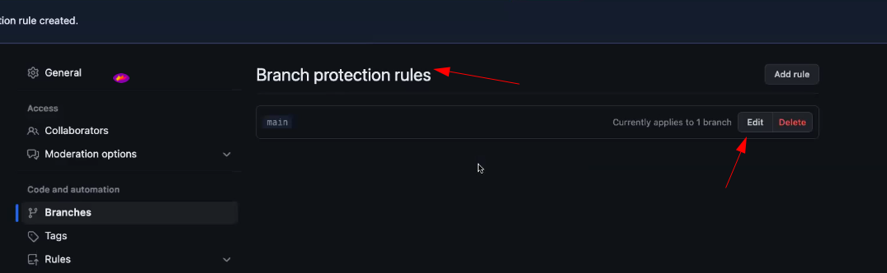
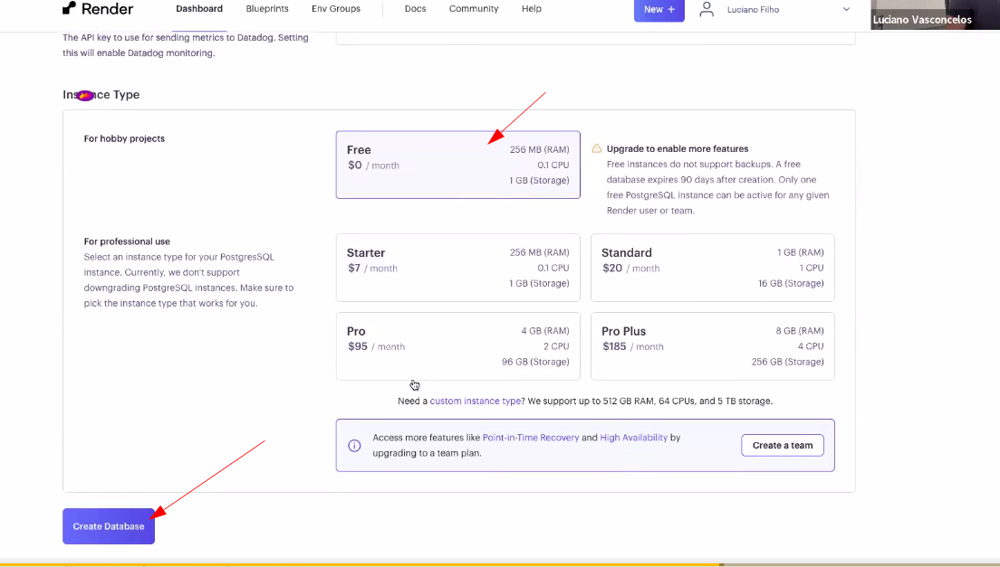
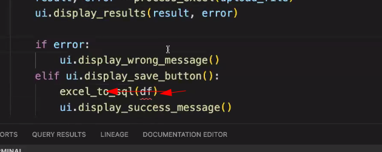
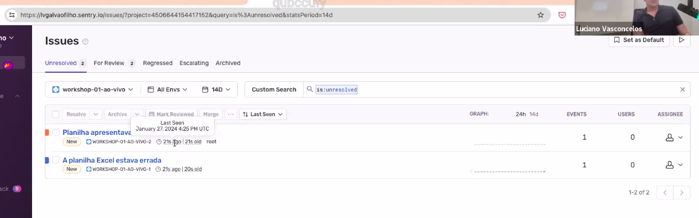

# Projeto e processamento de dados do Zero

Passo a passo de como estruturar um projeto de dados do zero, organizando o processo de ETL, Git, Testes unitários, CI/CD, etc.

### Como criar um repositório no Git HUB:

```bash
gh repo create
```
Veja a figura abaixo com o passo a passo para criação do repositório usando linha de comando.


Figura 01 - Criar repositório por linha de comando.

Como adicionar um arquivo no repositório e fazer o commit no repositório.

```bash
git add README.md
```

```bash
git commit -m "docs: Adicionar o arquivo README.md"
```

Para subir o arquivo para o repositório

```bash
git push
```

Sempre a primeira vez que estamos fazendo o git commit e o push, devemos informar qual a camada do repositório queremos enviar. Por exemmplo, camada "main", que é a principal.


```bash
git push --set-upstream origin main
```

Como fazer para recuperar um arquivo que foi excluído de um repositório do git hub ?

Executar o git log para verificar o histório de commit e escolher o apropriado para recuperar o arquivo que foi excluído.

```bash
git log
```

Após verificar o HASH devido do commit, executar o comando abaixo informando o arquivo que deseja recuperar.


```bash
git checkout <informar no HASH> -- <informar o nome do arquivo>
```


Figura 02 - Recuperando um arquivo que foi excluído.


### Escolhendo a versão python a qual será usada no projeto.

Depois da criação do repositório do Git Hub, é chegada o momento de definir a versão do python a ser utilizado.

Verificar versão do python:

```bash
python --version
```

Como vamos trabalhar com o Streamlit, devemos usar a versão 3.11.

Para fazer a gestão de qual versão vamos usar do Python no projeto, usaremos o pyenv.


```bash
pyenv versions
```

Vamos informar qual a versão do python que será utilizada no projeto, basta executar o comando abaixo na pasta do projeto que é a mesma que será atualizada no git hub.


```bash
pyenv local 3.11.5
```


Figura 03 - Definindo versão python para o projeto.


### Criação do ambiente virtual

Com a definição de qual versão python a ser criada no projeto, devemos fazer a criação do ambiente virtual.

Criar o arquivo para ambiente virtual, que nesse caso por questão de nomenclatura, usaremos o nome de ".venv". Importante entender que o nome do comando é "venv" e o nome do arquivo é ".venv", para não fazer confusão.

```bash
python -m venv .venv
```

Figura 04 - criação do ambiente virtual.


Importante ressaltar a necessidade de criação de um arquivo na pasta de projeto chamado gitgnore. Esse arquivo contém as informações do que não deve ser enviado para o repositório do github, quando é feito o commit. De forma simplista seria, git, para de verificar tais arquivos.


Figura 05 - Exemplo dos arquivo que serão ignorados no processo de commit.


Figura 06 - Arquivo de configuração do VSCODE.


Depois do ambiente virtual criado, é necessário "ligar", ou sejam deixar o ambiente virtual habilitado para a execução do projeto.

Comando para ser executado no windows:

```bash
source .venv/bin/activate
```

Comando para ser executado no Linux:

```bash
pyenv activate .venv
```

Depois do ambiente virtual ativado, vamos fazer a instalação dos pacotes que serão necessário para o projeto e que apenas existirá para essa pasta\projeto.


```bash
pip install streamlit
```

Importante compreender que tudo que for instalado nesse ambiente virtual, ficará no arquivo .venv e assim será possível validar e verificar o arquivo requirements.txt.


Executar o comando para criar o arquivo requirements.txt:

```bash
pip freeze > requirements.txt
```


Figura 07 - criação do arquivo requirements.txt


Validando o arquivo requirements txt:


Figura 08 - Validando o arquivo requirements.txt


Quando vocẽ for passar o seu projeto para alguma pessoa, o arquivo requirements.txt é uma ótima informação do que realmente é necessário para fazer a instalação do projeto.

```bash
pip install requirements.txt
```

# Informação básicas no README.md 

Em um projeto no github, o arquivo README, como boa prática, deve conter algumas informações básicas de como fazer o download do projeto.

Vejamos um exemplo:


Figura 09 - Exemplo do README parte 01.


Figura 10 - Exemplo do README parte 02.


Figura 11 - Exemplo do README parte 03.


# Preparando o projeto fazendo a organização das pastas


Criar a pasta tests, src e docs:


Figura 12 - Pastas criadas no projeto.


# Fazendo o contrato de dados (BACKEND)

Nessa etapa, vamos utilizar o pydantic para realizar o nosso contrato de dados (Qualidade dos dados, para validar se a coluna INT continua sendo INT, String continua sendo string e assim por diante.).

O pydantic faz a validação antes mesmo de fazer essa execução.

Instalação do pydantic:

```bash
pip install pydantic
```


Figura 13 - Instalação do pydantic no ambiente virtual .venv

Criar uma pasta chamada de testes e fazer o desenvolvimento de um arquivo python e assim fazer o uso do pydantic.


Figura 14 - Criação da pasta testes e arquivo python de testes.

Instalar o pytest:

```python
pip install pytest
```

Como executar o comando pytest ?


Executar o comando pytest na pasta de testes onde temos os arquivos em python, com o prefixo testes:

```python
pytest testes
```


Figura 15 - Comando pytest com erro, pois não temos o modelo pronto.

Sempre que tiver um módulo de testes, precisa criar um arquivo __init__.py na pasta de testes:


Figura 16 - Módulo __init__.py da pasta de testes.

Na pasta chamada src, vamos criar um arquivo python que será o nosso contrato de dados:


Figura - 17 - Criar arquivo python que será o nosso contrato de dados usando pydantic.


Esboço inicial de um contrato de dados usando o pydantic no arquivo contrato.py que fica na pasta chamada src:


Figura 18 - Primeiro esboço de contrato de dados usando pydantic.

Após isso, executar comando pytest na pasta testes:


Figura 19 - Pytestes com o esboço de contrato de dados. Exemplo com erro.

Como verificar o que apresentou erro ?

```python
pytest testes -y
```


Figura 20 - pytest testes -y com erro. Motivo ? Campo float e no contrato de dados está como INT.

Mudar o contrato de dados e executar comando pytest novamente.


Figura 21 - Ajuste no contrato de dados.

Executar o pytest testes novamente e validar o contrato de dados.


Figura 22 - Mais uma falha, agora na classe de categoria.


Configurar a coluna chamada categoria, da sua api JSON para validar o campo como apenas 3 valores possíveis. Não podemos deixar como string, pois pode ser qualquer valor e nesse caso, a coluna categoria do dicionário em questão da api, só pode receber três valoes diferentes.


Figura 23 - Contrato de dados com as validações da coluna categoria do dicionário.


- 1 - categoria 1

- 2 - categoria 2

- 3 - categoria 3


Ao executar o pytest teste novamente, o contrato de dados será valida e ficar 100% com sucesso pois a API JSON será validada.


Figura 24 - pyteste testes executado com sucesso.

Arquivo final do contrato de dados usando o pydantic:

IMPORTANTE: O código final abaixo possui um complemento de validação de dados também no campo e-mail, como uma espécie de constraint que vai avaliar se o campo possui um e-mail válido.

```python
from pydantic import BaseModel, EmailStr, PositiveFloat, PositiveInt, field_validator
from datetime import datetime
from enum import Enum

class CategoriaEnum(str, Enum):
    categoria1 = "categoria1"
    categoria2 = "categoria2"
    categoria3 = "categoria3"

class Vendas(BaseModel):
    """
    Modelo de dados para as vendas.

    Args:
        email (str): email do comprador
        data (datetime): data da compra
        valor (int): valor da compra
        produto (str): nome do produto
        quantidade (int): quantidade de produtos
        categoria (str): categoria do produto

    """
    email: EmailStr #específico para validar email pronto.
    data: datetime
    valor: PositiveFloat #valor float sempre positivo
    produto: str
    quantidade: PositiveInt
    categoria: CategoriaEnum # classe para validar valores

    @field_validator('categoria')
    def categoria_deve_estar_no_enum(cls, error):
        return error
```

# Trabalhando com o Front-End (Streamlit)

Criar dois novos arquivos:

- app.py
- frontend.py


Figura 25 - Python app e frontend para desenvolivento.

Início do meu arquivo app.py:


Figura 26 - Arquivo app.py

Arquivo frontend.py:

```python
import streamlit as st

class ExcelValidadorUI:
    def __init__(self):
        self.set_page_config()

    def set_page_config(self):
        st.set_page_config(
            page_title="Validador de schema excel"
        )
        
    def display_header(self):
        st.title("Insira o seu excel para validação")

    def upload_file(self):
        return st.file_uploader("Carregue seu arquivo Excel aqui", type=["xlsx"])
    
    def display_results(self, result, error):
        if error:
            st.error(f"Erro na validação: {error}")
        else:
            st.success("O schema do arquivo Excel está correto!")
        
    def display_save_button(self):
        return st.button("Salvar no Banco de Dados")
    
    def display_wrong_message(self):
        return st.error("Necessário corrigir a planilha!")
    
    def display_success_message(self):
        return st.success("Dados salvos com sucesso no banco de dados!")
```

Arquivo app.py:

```python
from frontend import ExcelValidadorUI # O ExcelValidadorUI é o nome da classe que está no código do frontend para chamar a IDE UI Web.
from backend import process_excel, excel_to_sql
import logging
import sentry_sdk

sentry_sdk.init(
    dsn="https://6cee69d21063f4615b44dcf164ce9527@o4505699197452288.ingest.sentry.io/4506644154417152",
    # Set traces_sample_rate to 1.0 to capture 100%
    # of transactions for performance monitoring.
    traces_sample_rate=1.0,
    # Set profiles_sample_rate to 1.0 to profile 100%
    # of sampled transactions.
    # We recommend adjusting this value in production.
    profiles_sample_rate=1.0,
)

def main():
    ui = ExcelValidadorUI()
    ui.display_header()

    upload_file = ui.upload_file()

    if upload_file:
        df, result, error = process_excel(upload_file)
        ui.display_results(result, error)

        if error:
            ui.display_wrong_message()
            logging.error("Planilha apresentava erro de schema")
            sentry_sdk.capture_message("A planilha Excel estava errada")
        elif ui.display_save_button():
            excel_to_sql(df)
            ui.display_success_message()
            logging.info(" Foi enviado com sucesso o banco SQL")
            sentry_sdk.capture_message("O banco SQL foi atualizado")

if __name__ == "__main__":
    main()
```

### Como executar a aplicação usando o streamlit ?

```bash
stramlit run src/app.py
```


Figura 27 - Executando o streamlit para interface web para validar o arquivo excel com base no contrato de dados.

Porém, desse modo, toda vez que iniciar o streamlit, será escolhido uma porta diferente e isso acaba não sendo um modo eficiente.

Segue o código para criar o streamlit com porta fixa. Mas, antes, faremos o teste funcional do mesmo.

Na pasta de testes, criar um arquivo chamado test_funcional.py:


Figura 28 - Iniciar o Teste funcional do streamlit.

Código python do teste funcional:

```python
from selenium import webdriver
from time import sleep
import pytest
import subprocess
from selenium.webdriver.firefox.options import Options
from selenium.webdriver.common.by import By

@pytest.fixture
def driver():
    # Iniciar o Streamlit em background
    process = subprocess.Popen(["streamlit", "run", "src/app.py"])
    options = Options()
    options.headless = True  # Executar em modo headless
    driver = webdriver.Firefox(options=options)
    # Iniciar o WebDriver usando GeckoDriver
    driver.set_page_load_timeout(5)
    yield driver

    # Fechar o WebDriver e o Streamlit após o teste
    driver.quit()
    process.kill()

def test_app_opens(driver):
    # Verificar se a página abre
    driver.get("http://localhost:8501")
    sleep(5)

def test_check_title_is(driver):
    # Verificar se a página abre
    driver.get("http://localhost:8501")
    # Verifica se o titulo de página é
    sleep(2)
    # Capturar o título da página
    page_title = driver.title

    # Verificar se o título da página é o esperado
    expected_title = "Validador de schema excel"  # Substitua com o título real esperado
    assert page_title == expected_title

def test_check_streamlit_h1(driver):
    # Acessar a página do Streamlit
    driver.get("http://localhost:8501")

    # Aguardar para garantir que a página foi carregada
    sleep(2)  # Espera 5 segundos

    # Capturar o primeiro elemento <h1> da página
    h1_element = driver.find_element(By.TAG_NAME, "h1")

    # Verificar se o texto do elemento <h1> é o esperado
    expected_text = "Insira o seu excel para validação"
    assert h1_element.text == expected_text
```

Fazer a instalação do selenium:

```python
pip install selenium
```


Figura 29 - Install do selenium

Vamos fazer o teste do arquivo test_funcional.py usando comando do pytest:


Figura 30 - Fazendo o teste funcional do arquivo test_funcional.py


Estrutrura da pasta de testes até o momento:


Figura 31 - Estrutura da pasta de tests.

### ALERTA DE APRENDIZADO

Antes de executar o teste funcional, será necessário instalar o pytask e assim o mesmo vai criar um arquivo automaticamente:

```bash
pip install taskpi
```


Figura 32 - pip install taskpi.


Com vai ser criado o arquivo pyproject e assim vai executar alguns comandos que são necessários executar várias vezes de modo automatizado.


Figura 33 - Comandos repetitivos do pyproject.

Arquivo pyproject:

```python
[tool.taskipy.tasks]
run = "lsof -ti :8501 | xargs kill -9 | streamlit run src/app.py"
test = "lsof -ti :8501 | xargs kill -9 | pytest tests -v"
docs = "lsof -ti :8000 | xargs kill -9 | mkdocs serve"
```

Ligar a aplicação do Fronend:

```bash
task run
```


Figura 34 - Task run.

Antest de executar os testes do pytest run, alguns módulos do pydantic precisam ser instalados:

Vamos a eles:

```bahs
pip install "pydantic[email]"
```


Figura 35 - pydantic install email.


Agora podemos executar o task test do taskpy:


Figura 36 - Teste funcional do frontend.

### Alrta de aprendizado 2

Editar o arquivo gitignore com boa prática:

Acessar o site Toptal gitignore para python:


Figura 37 - Site Toptal gitignore para Python parte 01.


Figura 38 - Site Toptal gitignore para Python parte 02.

Gitinore para Python:


```python
# Created by https://www.toptal.com/developers/gitignore/api/python
# Edit at https://www.toptal.com/developers/gitignore?templates=python

### Python ###
# Byte-compiled / optimized / DLL files
__pycache__/
*.py[cod]
*$py.class

# C extensions
*.so

# Distribution / packaging
.Python
build/
develop-eggs/
dist/
downloads/
eggs/
.eggs/
lib/
lib64/
parts/
sdist/
var/
wheels/
share/python-wheels/
*.egg-info/
.installed.cfg
*.egg
MANIFEST

# PyInstaller
#  Usually these files are written by a python script from a template
#  before PyInstaller builds the exe, so as to inject date/other infos into it.
*.manifest
*.spec

# Installer logs
pip-log.txt
pip-delete-this-directory.txt

# Unit test / coverage reports
htmlcov/
.tox/
.nox/
.coverage
.coverage.*
.cache
nosetests.xml
coverage.xml
*.cover
*.py,cover
.hypothesis/
.pytest_cache/
cover/

# Translations
*.mo
*.pot

# Django stuff:
*.log
local_settings.py
db.sqlite3
db.sqlite3-journal

# Flask stuff:
instance/
.webassets-cache

# Scrapy stuff:
.scrapy

# Sphinx documentation
docs/_build/

# PyBuilder
.pybuilder/
target/

# Jupyter Notebook
.ipynb_checkpoints

# IPython
profile_default/
ipython_config.py

# pyenv
#   For a library or package, you might want to ignore these files since the code is
#   intended to run in multiple environments; otherwise, check them in:
# .python-version

# pipenv
#   According to pypa/pipenv#598, it is recommended to include Pipfile.lock in version control.
#   However, in case of collaboration, if having platform-specific dependencies or dependencies
#   having no cross-platform support, pipenv may install dependencies that don't work, or not
#   install all needed dependencies.
#Pipfile.lock

# poetry
#   Similar to Pipfile.lock, it is generally recommended to include poetry.lock in version control.
#   This is especially recommended for binary packages to ensure reproducibility, and is more
#   commonly ignored for libraries.
#   https://python-poetry.org/docs/basic-usage/#commit-your-poetrylock-file-to-version-control
#poetry.lock

# pdm
#   Similar to Pipfile.lock, it is generally recommended to include pdm.lock in version control.
#pdm.lock
#   pdm stores project-wide configurations in .pdm.toml, but it is recommended to not include it
#   in version control.
#   https://pdm.fming.dev/#use-with-ide
.pdm.toml

# PEP 582; used by e.g. github.com/David-OConnor/pyflow and github.com/pdm-project/pdm
__pypackages__/

# Celery stuff
celerybeat-schedule
celerybeat.pid

# SageMath parsed files
*.sage.py

# Environments
.env
.venv
env/
venv/
ENV/
env.bak/
venv.bak/

# Spyder project settings
.spyderproject
.spyproject

# Rope project settings
.ropeproject

# mkdocs documentation
/site

# mypy
.mypy_cache/
.dmypy.json
dmypy.json

# Pyre type checker
.pyre/

# pytype static type analyzer
.pytype/

# Cython debug symbols
cython_debug/

# PyCharm
#  JetBrains specific template is maintained in a separate JetBrains.gitignore that can
#  be found at https://github.com/github/gitignore/blob/main/Global/JetBrains.gitignore
#  and can be added to the global gitignore or merged into this file.  For a more nuclear
#  option (not recommended) you can uncomment the following to ignore the entire idea folder.
#.idea/

### Python Patch ###
# Poetry local configuration file - https://python-poetry.org/docs/configuration/#local-configuration
poetry.toml

# ruff
.ruff_cache/

# LSP config files
pyrightconfig.json

# End of https://www.toptal.com/developers/gitignore/api/python
```

Instalar também uma biblioteca principal para trabalhar com excel, mesmo que você use o pandas:

```bash
pip install openpyxl
```

# Como fazer o Deploy de uma aplicação do Streamlit ?

Usando o Streamlit cloud:


Figura 39 - Deploy do Streamlit na nuvem Parte 01.


Figura 40 - Deploy do Streamlit na nuvem Parte 02.

IMPORTANTE:

O Streamlit ler e instala o requirements.txt para poder iniciar a aplicação. Importante sempre deixar esse arquivo atualizado.

Como criar o requirements.txt ?

Executar o comando abaixo na console .venv do seu projeto:

```bash
pip freeze > requirements.txt
```


Figura 41 - Criação do arquivo requirements.txt na console .venv do projeto.

**Fazer o Deploy novamente no Streamlit Cloud.**

# Como fazer o CI/CD dessa aplicação.

Finalmente chegamos no momento de realizar o CI/CD para essa aplicação, com o desenvolvimento de uma aplicação para validar arquivo excel, usando um contrato de dados com base no pandict, validação da estrutura do arquivo excel com base no streamlit, deploy do streamlit em nuvem.

Como fazer o uso dos conceitos de CI/CD no GitHub para fazer o Deploy da aplicação em produção ? Como criar um processo de desenvolvimento mais seguro?


Primeiro passo para iniciar o processo de CI/CD para evitar commit direto na main.

Ir no GitHub, settings, branches.


Figura 42 - Acessar GitHub >> Settings >> Add branch protection rule.


Figura 43 - Add branch protection rule.


Tela de edição para regras na branch main. CLicar em Edit:




Figura 44 - Edit Branch protection rules.


Realizar o pull request antes de fazer um merging do arquivo a qual você está desenvolvendo com o que está em produção.


Figura 45 - Configurar pull requests.

### Atenção nesse vídeo de criar branch pois ele está fazendo o bypass nas regras e ainda assim está fazendo commit na main. Enviar uma pergunta sobre isso para o Luciano Galvão. Vídeo minuto 01:47:00 - 01:49:00

# Estratégias de BRANCH no conceito CI/CD.

Primeiro passo é bloquear a MAIN e criar uma pull request. Por exemplo, você deseja contribuir para um projeto. Mas você não tem acesso a branch main. Como fazer?

Ir ao projeto open-source, clicar no botão Fork.


Figura 46 - Botão Fork para iniciar contribuição projeto.


Nesse momento ele vai criar uma repositório no seu login do github.


Figura 47 - Criando um repositório no seu login do github para contribuir no projeto.


Figura 48 - Forking um projeto no seu github para iniciar o processo de contribuição.

Após Fork, realizar o GitClone e assim iniciar o processo de desenvolvimento local.


Figura 49 - Realizando o GitClone.

# Retornando para o nosso projeto: Como fazer a nossa Branch

Antes de fazer um push direto na MAIN, queremos enviar para uma pessoa fazer a aprovação.


Figura 50 - Processo de Deploy na Main.

O processo de CI é definir um conjunto de ações que devem ser executadas para avaliar o seu processo de CI. Como fazer essa configuração e passar a usar o Git Actions.

Vejamos:

Criar uma pasta chamada ".github".


Figura 51 - Criando a pasta ".githb"


Em seguida, na workflow, criar o arquivo com a extensão yml.


Figura 52 - Arquivo o tipo .yml.


Segue o modelo do yml:

```yml
name: ci

on: pull_request
jobs:
    test:
        runs-on: ubuntu-latest
        steps:
            - name: Baixar o repositório
              uses: actions/checkout@v4

            - name: Instalar o Python
              uses: actions/setup-python@v5
              with:
                python-version: ${{ matrix.python-version }}

            - name: Instalo as libs
              run: pip install -r requirements.txt

            - name: rodar minha rotina de testes
              run: pytest tests/test_contrato.py 
```


E como fazer a instalação e configuração do CI ?

Simples, apenas fazer o COMMIT do arquivo com a extensão ".yml".


Figura 53 - Commit do arquivo YML.


Vamos fazer um processo de modificação ?

Criar uma Branch chamada DEV e mudar para a mesma:

```bash
git branch dev
git checkout dev
```


Figura 54 - Criando a mudando para a branch dev.

Adicionar um arquivo simples na pasta src e em seguida fazer o commit:


Figura 55 - Criando novo arquivo para fazer teste de commit usando a branch DEV.


Figura 56 - Fazendo commit na branch DEV.

Executar o git push em seguida para validar o commit.


Figura 57 - Executando o git push com a opção upstream.


Validando esse commit na branch DEV no seu github.


Figura 58 - Solicitação de commit na Main que veio por meio da Branch DEV. Clicar em Compare e pull request.


Padrão de descrição para abrir um pull request.


Figura 59 - Criar o Pull request.


# Revisão de CI/CD

- Ao tratar bugs no Pipeline de dados, criar uma rotina de teste que possa prever e evitar esse erro de acontecer novamente no futuro;
- Com essa rotina de testes implementadas em cada bug novo, evitará erros regressivos, ou seja, o mesmo erro acontecer novamente no futuro.
- 

# Inserir os dados Excel no Banco de dados

Essa etapa é a de após o arquivo excel ser validado, fazer a insersão em um banco de dados.

### Criar um banco de dados Postgres gratuito.

Para realizar a etapa de inserir os dados em um banco do tipo postgres, vamos utilizar o Dbeaver e o Render.

### Iniciando o uso do Render (Render.com)

Acessar a url > get started for free.

```link
www.render.com
```


Figura 60 - Render.com >> get started for free.


Clicar em New + e iniciar a criação de uma instância de banco de dados PostGres.


Figura 61 - Criando uma instância PostGres no render.com


Figura 62 - Criar banco de dados Postgres


Figura 63 - Criando instância postgres parte 01.




Figura 64 - Finalizando a criação instância PostGres

## Acessar o banco de dados Postgres criado.

Instalar e abrir o Dbeaver:


Figura 65 - Uso do Dbeaver.


Figura 66 - Possibilidades de conexões usando o DBeaver.


Figura 67 - Obter as variáveis de ambiente do Postgres criado no render.com.

Para conectar ao host do banco de dados, acesar a external Database url e obter tudo que estiver após o @.


Figura 68 - Obtendo o nome do hostname para fazer a conexão no banco de dados usando o Dbveaver.


Figura 69 - Conexão ao banco de dados.


Figura 70 - Criação da tabela para receber os dados do Excel.


Figura 71 - ATENÇÃO: Os tipos do Python são diferentes do banco de dados. É preciso ter atenção a essas particularidades.

Com a instância de banco de dados criada, é chegada a hora de fazer commit na branch de dev, pois vamos iniciar o processo de validação e inserção dos dados e assim faremos edição dos arquivos de frotend.

Nesse caso vamos criar uma nova branch. Para cada nova funcionalidade, criar uma nova branch e com a denominação que faça sentido com a atualização.

```bash
git checkout -B feature-sql
```


Figura 72 - Criar nova Branch.

Vamos criar um teste de Integração (Teste unitários, funcional e de integração. Esses 3 são importantes e nessa etapa vamos criar o terceiro):


Figura 73 - Início para a criação do teste de integração.

Esse arquivo de teste de integração conterá as seguintes ações:

- Verificar se o banco de dados está online.
- Verificar o Schema da tabela (Colunas e tipo).


Como inserir variáveis no Python ? Fazer a instalação dotenv.

```python
pip install python-dotenv
```


Figura 74 - Instalação do dotenv.


Como inserir essa senhas de conexão no python ?

Criar o arquivo .env e em seguida incluir esse arquivo no gitignore, para que as senhas não fiquem salvas no github.


Figura 75 - Configuração final do .env

IMPORTANTE INCLUIR O ARQUIVO EM QUESTÃO NO GITIGNORE.


Arquivo python de teste de integração:

```python
import pandas as pd
import os
from dotenv import load_dotenv

load_dotenv(".env")

# Lê as variáveis de ambiente
POSTGRES_USER = os.getenv('POSTGRES_USER')
POSTGRES_PASSWORD = os.getenv('POSTGRES_PASSWORD')
POSTGRES_HOST = os.getenv('POSTGRES_HOST')
POSTGRES_PORT = os.getenv('POSTGRES_PORT')
POSTGRES_DB = os.getenv('POSTGRES_DB')

# Cria a URL de conexão com o banco de dados
DATABASE_URL = f"postgresql://{POSTGRES_USER}:{POSTGRES_PASSWORD}@{POSTGRES_HOST}:{POSTGRES_PORT}/{POSTGRES_DB}"

def test_read_data_and_check_schema():
    df = pd.read_sql('SELECT * FROM vendas', con=DATABASE_URL)

    # Verificar se o DataFrame não está vazio
    assert not df.empty, "O DataFrame está vazio."

    # Verificar o schema (colunas e tipos de dados)
    expected_dtype = {
        'email': 'object',  # object em Pandas corresponde a string em SQL
        'data': 'datetime64[ns]',
        'valor': 'float64',
        'quantidade': 'int64',
        'produto': 'object',
        'categoria': 'object'
    }
    print(df.dtypes.to_dict())
    assert df.dtypes.to_dict() == expected_dtype, "O schema do DataFrame não corresponde ao esperado."
```

Agora vamos executar o teste de integração para validar se o banco de dados está disponível:

Antes, é necessário fazer a instalação do SQL alchemy.

```bash
pip install sqlalchemy
pip install psycopg2-binary
```

```bash
pytest tests/test_integracao.py
```


Figura 76 - Fazendo o pip install sql alchemy.


Figura 77 - Fazendo teste de integração.


Inserir os dados no banco de dados para o teste funcional obter sucesso:

No arquivo de backend, será necessário desenvolver uma função para que os dados sejam salvos do Excel para o Postgres. A mesma terá o nome de excel_to_sql.


Figura 78 - Nova função para salvar dados no postgres.

Modificação no FronEnd para atender a nova funcionalidade:


Figura 79 - Código de frontend usando o streamlit. Simples, com algumas poucas linhas.

TAmbém será necessário ajustar o arquivo app.py, para poder associar as novas funcionalidades do backend e do frontend.


Figura 80 - Função do backend no arquivo app.py.


Figura 81 - Arquivo app.py com a integração das novas funcionalidades para salvar os dados no postgres.

Como fazer para testar se a aplicação estáo funcionando ?

Vejamos:


Figura 82 - Task run para abrir o App Web para validar o excel.


Figura 83 - Incluir arquivo e caso schema esteja correto, ficará com a imagem de sucesso.

Ajustar o processo de salvar no banco de dados no arquivo de app.py. Faltou passar o df.



Figura 84 - App.py com df para salvar do excel para o sql.

No backend.py, devemos inserir o df para retornar como uma variável após valisdar o schema escolhido.


Figura 85 - return df no backend.py.

No arquivo app.py, no if upload_file, devemos passar também o df:


Figura 86 - Arquivo app.py passando o df no upload do arquivo.

Inserir também o df no backend.py no return em caso de erro o exception:


Figura 87 - Return df em caso de erro ou exception.


Figura 88 - Dados salvos no banco de dados com sucesso.


# Fazendo o teste de integração.

Após o desenvolvimento de todas as funcionalidades desde a validação arquivo, tratamento de erros, mensagens, salvar no postgres, estamos aptos a fazer o teste de integração.

```bash
pytest tests/teste_integracao.py
```

Ou executar o teste geral, de todos que estão na pasta tests:


Figura 89 - Executando ao mesmo tempo teste de integração, funcional e de contrato.


Figura 90 - Inserindo as variáveis de ambiente para se conectar ao PostGres no Deloy do streamlit. Atenção pois precisa ser Python 3.11.

# Observabilidade

 O software que será utilizado para o aspecto de observabilidade será o Sentry.

 Nessa caso o Sentry vai monitorar os logś gerados pela nossa aplicação em Python. Para isso, o desenvolvedor deve orquestrar o processo de loging no python.

 No notebook python, você precisará fazer o import loging e nas mensagens de erro, informar o uso da biblioteca loging.

 

 Figura 91 - Uso do loging no python para gerar os log's e em seguida utilizar o Sentry para fazer o monitoramento.


Figura 92 - Configurar o log no python.

## Configurando o SENTRY


Vamos acessar o Sentry, que será a nossa plataforma de loging.


Figura 93 - Acesso ao Sentry.


Figura 94 - Acessar projeto e clicar em "Create Project".


Figura 95 - Informar nome do projeto e clicar skip para framework.

Remover o código anterior do loging feito o python, fazer a instalação do sentry_sdk e copiar o código fornecido na tela do próprio sentry para orquestrar o nosso validador Excel em python.


Figura 96 - Configuração do Sentry


Figura 97 - Código Python para usar o Sentry.


Figura 98 - Código para enviar a mensagem para o Sentry.


Figura 99 - Mais uma exemplo de envio de mensagem para o Sentry.



Figura 100 - Envio do erro para o Sentry.